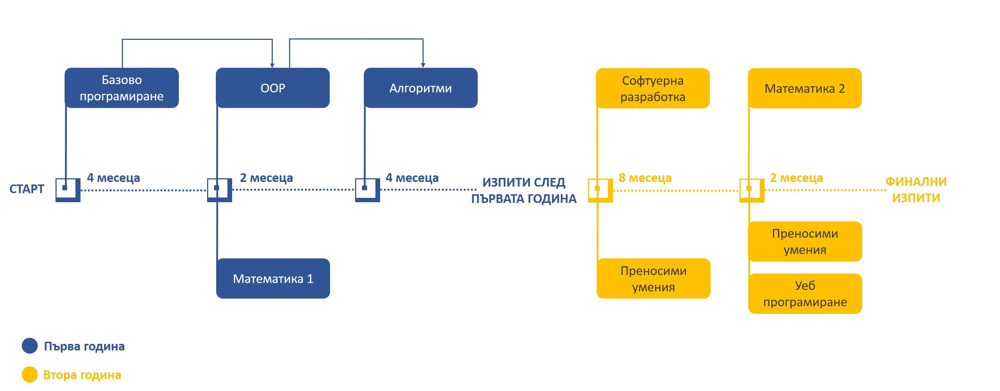

# Програма

## Кратка мотивация за програмата

**Основни параметри на програмата:**

* Програмата е предвидена за срок от 2 години
* Курсовете от един етап вървят паралелно.
* В една седмица се случват 3 занятия.
* След всяко ниво ще има изпит, който да диагностицира получените знания.

**Какво цели този курс:**

* Да бъде фундаментален. Да покаже основните и най-важни неща в програмирането, след което да ги приложи на практика.
* Да зариби учениците и да им покаже какво могат да направят, ако имат тези знания и умения
* Да ги подготви възможно най-близко до стажантска / junior позиция, след завършването на курса.
* Да има достатъчно разработени материали и задачи, което да позволява учене и с по-бавно темпо.
* Да подтикне учениците да се състезават в НОИ, НОИТ и всички други видове хакатони и отборни състезания.

**Какво не цели този курс:**

* Да замести работата на университетите. Темите, които се засягат тук и имат общо с университетски теми, няма да бъдат изследвани в дълбочина. Тяхната цел е да създаде интуиция в децата.
* Да замести школите, които подготвят децата за Олимпиадата по Информатика. Искаме да насърчим децата да ходят и да се състезават. За това те ще трябва да знаят и C++, което не се покрива от тази програма. Тук школите по програмиране могат да видят увеличен наплив от деца, които имат интерес към алгоритмите.

## Детайлна Програма

| Етап                 | Курс                                                                 | Език за Програмиране                         | Седмично Натоварване | Продължителност (При 10 месеца в годината) | Детайлна Програма? | Година    |
|----------------------|----------------------------------------------------------------------|----------------------------------------------|----------------------|--------------------------------------------|--------------------|-----------|
| 1                    | Базово Програмиране                                                  | * Python                                     | 2 пъти               | 3 месеца                                   | Готова             | **Първа** |
| 1                    | Математика 1 (Дискретна Математика и Базов Анализ))                  | * Лист и химикалка и примери с Python        | 1 път                | Готова                                     |                    |           |
| 2                    | Обектно Ориентирано Програмиране                                     | * Java                                       | 2 пъти               | 2 месеца                                   | Готова             |           |
| 2                    | Математика 2 (Бройни системи, Комбинаторика, Базова Линейна Алгебра) | * Лист и химикалка и примери с Java          | 1 път                | Готова                                     |                    |           |
| 3                    | Структури от Данни и Алгоритми                                       | * Java                                       | 3 пъти               | 5 месеца                                   | Готова             |           |
| Изпит                | Изпит след края на първата година.                                   | * Java                                       |                      |                                            |                    |           |
| 4                    | Софтуерна Разработка                                                 | * Java * Java 8 за FP * SQL за бази от данни | 2 пъти               | 5 месеца                                   | Готова             | **Втора** |
| 4                    | Преносими Умения                                                     | 1 път                                        |                      |                                            |                    |           |
| 5                    | Работен Процес                                                       | * Java                                       | 2 пъти               | 3 месеца                                   | Готова             |           |
| 5                    | Уеб Програмиране                                                     | * HTML / CSS * JavaScript * Java             | 1 път                | Готова                                     |                    |           |
| 6                    | Дизайн и Моделиране                                                  | * Java                                       | 2 пъти               | 2 месеца                                   | Готова             |           |
| 6                    | Преносими Умения                                                     | * Презентации * Интервюта * Защита на дизайн | 1 път                |                                            |                    |           |
| Защитаване на Проект | Серия от Финални Изпити                                              | * Java * JavaScript / HTML / CSS             |                      |                                            |                    |           |

### Базово Програмиране

| Седмица | Първо занятие                                                                                                                                                                                                                                                                                                                                                                                                                                                                                                                                                                                                                                                                                                                                                                                                                                                                                                                             | Второ занятие                                                                                                                                                                                                                                                                                                                                    |
|---------|-------------------------------------------------------------------------------------------------------------------------------------------------------------------------------------------------------------------------------------------------------------------------------------------------------------------------------------------------------------------------------------------------------------------------------------------------------------------------------------------------------------------------------------------------------------------------------------------------------------------------------------------------------------------------------------------------------------------------------------------------------------------------------------------------------------------------------------------------------------------------------------------------------------------------------------------|--------------------------------------------------------------------------------------------------------------------------------------------------------------------------------------------------------------------------------------------------------------------------------------------------------------------------------------------------|
| 1       | * Въвеждаща мотивационна лекция за Програмирането. Преглед на това, което ни очаква. * Setup на Python IDLE * Що е то програмен код и "source file"? * Що е то REPL и как ще го използваме, за да тестваме?                                                                                                                                                                                                                                                                                                                                                                                                                                                                                                                                                                                                                                                                                                                               | * Основно понятие за Values и Expressions. За какво ни служат в нашия език за програмиране? * От какво се изгражда нашият език за програмиране и защо имаме синтаксис? Какво може и не може да пишем? * Основни идеи на синтаксиса в Python. Обяснение на идеята за "Whitespace significant език" * Как може да складираме и наименуваме Values? |
| 2       | * Типове. Това, което имат нашите стойности. За какво ни служат, защо са важни и интересуват ли ни типовете? * Що е то оператор? Как нашите оператори се връзват с типовете. Една дълбока и важна връзка. * Обясняване на термините Implicit и Explicit. * Вход-Изход. Как да взимаме информация отвън и да показваме нашия резултат? * Какво е Statement и как той се включва в картинката с Values и Expression?                                                                                                                                                                                                                                                                                                                                                                                                                                                                                                                        | * Истина и Лъжа. Основополагащият тип Boolean, който ни помага да взимаме решения в нашата програма. * if statement и Boolean operators.                                                                                                                                                                                                         |
| 3       | * Loop statements - как да опишем на език за програмиране следното: "Прави X, докато има смисъл да го правим (по някакво условие Y)" * Запознаване със структурата на while statement–а.                                                                                                                                                                                                                                                                                                                                                                                                                                                                                                                                                                                                                                                                                                                                                  |                                                                                                                                                                                                                                                                                                                                                  |
| 4       | * Как да складираме повече от 1 стойност под едно общо име? Въвеждаме в идеята за списъци и масиви. * Понятие за "индекс" и индексиране на списъци. Защо в програмирането броим от 0? Ако знаем дължината на списъка, кой е последният индекс? * Оператори над списъци - как да добавим елемент в края на даден списък? А в началото? * Как може да променим произволна стойност в списък по негов индекс? * Как да извършим действие "За всеки елемент от списъка"? Обхождане на списък чрез while statement. * Запознаване с for statement-а в Python. * Възможност за обхождане по индекси * Възможност за обхождане по елементи                                                                                                                                                                                                                                                                                                       |                                                                                                                                                                                                                                                                                                                                                  |
| 5       | * Как представяме текст-а в езиците за програмиране? Запознаване с понятието за "низ". * Как представяме низове като синтаксис? Кавички - единични и двойни. * Разлика между низ и променлива. Много съществено нещо. * Връзка между списъците и низовете. Идея за списък от символи. Идея за индексиране на низове. * Основни оператори в/у низове. Как може да "построим" наше съобщение? * Обхождане на низове, символ по символ, чрез while. * Обхождане на низове, символ по символ, чрез for. * Решаване на задачи със списъци и низове.                                                                                                                                                                                                                                                                                                                                                                                            |                                                                                                                                                                                                                                                                                                                                                  |
| 6       | * Какво правим, когато кодът ни започне да се повтаря? А когато решаваме един и същи проблем по няколко пъти в една програма? Когато програмата стане нечетима за отрицателно време? * **Въведение в понятието и идеята за функция.** Какво представлява функция в програмирането и как ни помага животът ни като програмисти да бъде смислен? * Нова доза синтаксис за функции. * Вход-Изход на една функция - какво представляват аргументите на една функция? * Вход-Изход на една функция - какво представлява "върната стойност"? Ключовата дума return. * Каква е разликата между функция, която print–ва резултата си и функция, която return–ва? * Подход за решаване на по-големи проблеми - разбиване на по-малки проблеми и връзване на тази идея с функциите. * Като за финал - видимост на променливите и изчистване на всички обърквания кое как да се казва и кое с кое ще има проблем, ако се казва по един и същи начин. |                                                                                                                                                                                                                                                                                                                                                  |
| 7       | * Problem solving - подходи за решаване на проблеми. * Решаване на задачи с всичко научено до сега.                                                                                                                                                                                                                                                                                                                                                                                                                                                                                                                                                                                                                                                                                                                                                                                                                                       |                                                                                                                                                                                                                                                                                                                                                  |
| 8       | * Как може да комбинираме един елемент с всеки друг от даден списък? Как може да проверим всички наредени двойки от елементи на списък дали отговарят на дадено условие? * **Мотивация и идея за вложени цикли.** * Синтаксис и идеи - вложени цикли за решаване на определен тип задачи.                                                                                                                                                                                                                                                                                                                                                                                                                                                                                                                                                                                                                                                 | * Какво означава безкраен цикъл? Добра или лоша идея е това? * Има ли значение какъв цикъл използваме? while? for? * Има ли значение дали обхождаме по елементи или по индекси? * Взаимно-заменяеми ли са for и while? Загатване на идеята за "стил на програмиране" и "четимост на кода"                                                        |
| 9       | * Как да преброим колко съвпадащи имена има в даден клас? * Какъв тип е индексът на даден списък? Каква информация ни дава този тип? * Има ли възможност този индекс да бъде от друг тип? Може ли да опишем една "таблица" в език за програмиране? * Въвеждане в идеята за речници - нещо, което пази "ключ -> стойност", където ключът може да бъде низ. * Синтаксис и задачи с речници. * Обхождане на речници - каква е идеята? За всеки ключ? За всеки ключ и стойност?                                                                                                                                                                                                                                                                                                                                                                                                                                                               | * Поглед назад към списъци, масиви и речници. Опит за вдигане на абстракцията на разбирането. * Интуиция за понятието "Структури от Данни"                                                                                                                                                                                                       |
| 10      | * Как може да представим множествата, които се учат по Дискретна Математика? * Решаване на задачи с множества в Python - описване на основните операции - без повтарящи се елементи, подредбата няма значение, обединение, сечение, разлика, декартово произведение.                                                                                                                                                                                                                                                                                                                                                                                                                                                                                                                                                                                                                                                                      |                                                                                                                                                                                                                                                                                                                                                  |
| 11      | * Какво всъщност се случва, когато пускаме Python програма? * Интуиция за понятията компилация и интерпретация. * Обяснение на как работи python, показване на python програмата през конзолен ред и обясняване на идеята зад REPL. * Интуиция за това какви езици съществуват. Класификация според типове, според компилация / интерпретация, според средите за разработка.                                                                                                                                                                                                                                                                                                                                                                                                                                                                                                                                                              | * Програмирането е занаят, а занаятчиите имат нужда от инструменти. * Въвеждане на понятието за текстов редактор - настройка на Sublime за разработка. Изход от IDLE.                                                                                                                                                                            |
| 12      | * Ретроспекция * Решаване на задачи с всичкото научено до сега                                                                                                                                                                                                                                                                                                                                                                                                                                                                                                                                                                                                                                                                                                                                                                                                                                                                            |                                                                                                                                                                                                                                                                                                                                                  |

