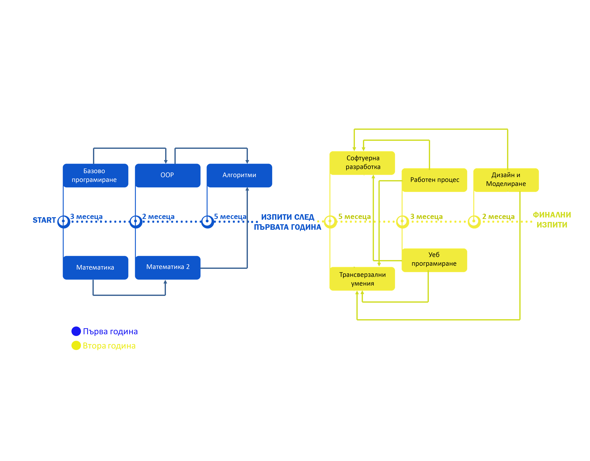

********
Програма
********

График на курса, разпделен във времето
######################################

Кратка мотивация за програмата
##############################

**Основни параметри на програмата:**

-  Програмата е предвидена за срок от 2 години
-  Курсовете от един етап вървят паралелно.
-  В една седмица се случват 3 занятия.
-  След всяко ниво ще има изпит, който да диагностицира получените
   знания.

**Какво цели този курс:**

-  Да бъде фундаментален. Да покаже основните и най-важни неща в
   програмирането, след което да ги приложи на практика.
-  Да зариби учениците и да им покаже какво могат да направят, ако имат
   тези знания и умения
-  Да ги подготви възможно най-близко до стажантска / junior позиция,
   след завършването на курса.
-  Да има достатъчно разработени материали и задачи, което да позволява
   учене и с по-бавно темпо.
-  Да подтикне учениците да се състезават в НОИ, НОИТ и всички други
   видове хакатони и отборни състезания.

**Какво не цели този курс:**

-  Да замести работата на университетите. Темите, които се засягат тук и
   имат общо с университетски теми, няма да бъдат изследвани в
   дълбочина. Тяхната цел е да създаде интуиция в децата.
-  Да замести школите, които подготвят децата за Олимпиадата по
   Информатика. Искаме да насърчим децата да ходят и да се състезават.
   За това те ще трябва да знаят и C++, което не се покрива от тази
   програма. Тук школите по програмиране могат да видят увеличен наплив
   от деца, които имат интерес към алгоритмите.

Детайлна програма
#################

+-----------+-------------------------------+---------------+-----------+---------+-----+
| Етап      | Курс                          | Език за       | Седмично  | Продълж | Год |
|           |                               | програмиране  | натоварва | ителнос | ина |
|           |                               |               | не        | т       |     |
+===========+===============================+===============+===========+=========+=====+
| 1         | Базово Програмиране           | Python        | 2 пъти    | 3       | Пър |
|           |                               |               |           | месеца  | ва  |
+-----------+-------------------------------+---------------+-----------+---------+-----+
| 1         | Математика 1 (Дискретна /     | Лист / хартия | 1 път     | 3       | Пър |
|           | Анализ)                       | / Python      |           | месеца  | ва  |
+-----------+-------------------------------+---------------+-----------+---------+-----+
| 2         | Обектно Ориентирано           | Java          | 2 пъти    | 2       | Пър |
|           | Програмиране                  |               |           | месеца  | ва  |
+-----------+-------------------------------+---------------+-----------+---------+-----+
| 2         | Математика 2 (Бройни системи, | Лист / хартия | 1 път     | 2       | Пър |
|           | Комбинаторика, Базова Линейна | / Java        |           | месеца  | ва  |
|           | Алгебра)                      |               |           |         |     |
+-----------+-------------------------------+---------------+-----------+---------+-----+
| 3         | Структури от Данни и          | Java          | 3 пъти    | 5       | Пър |
|           | Алгоритми                     |               |           | месеца  | ва  |
+-----------+-------------------------------+---------------+-----------+---------+-----+
| Изпит     | Изпит след края на първата    | Java          |           |         |     |
|           | година.                       |               |           |         |     |
+-----------+-------------------------------+---------------+-----------+---------+-----+
| 4         | Софтуерна Разработка          | Java + SQL    | 2 пъти    | 5       | Вто |
|           |                               |               |           | месеца  | ра  |
+-----------+-------------------------------+---------------+-----------+---------+-----+
| 4         | Преносими умения              | Разговори /   | 1 път     | 5       | Вто |
|           |                               | презентации   |           | месеца  | ра  |
+-----------+-------------------------------+---------------+-----------+---------+-----+
| 5         | Работен Процес                | Java          | 2 пъти    | 3       | Вто |
|           |                               |               |           | месеца  | ра  |
+-----------+-------------------------------+---------------+-----------+---------+-----+
| 5         | Уеб Програмиране              | Java, HTML /  | 1 път     | 3       | Вто |
|           |                               | CSS /         |           | месеца  | ра  |
|           |                               | JavaScript    |           |         |     |
+-----------+-------------------------------+---------------+-----------+---------+-----+
| 6         | Дизайн и Моделиране           | Java          | 2 пъти    | 2       | Вто |
|           |                               |               |           | месеца  | ра  |
+-----------+-------------------------------+---------------+-----------+---------+-----+
| 6         | Преносими Умения              | Разговори /   | 1 път     | 2       | Вто |
|           |                               | Презентации   |           | месеца  | ра  |
+-----------+-------------------------------+---------------+-----------+---------+-----+
| Защитаван | Серия от Финални Изпити       | Използване на |           |         |     |
| е         |                               | всичко        |           |         |     |
| на проект |                               | научено       |           |         |     |
+-----------+-------------------------------+---------------+-----------+---------+-----+

Програма за базово програмиране
###############################

+--------------------------------------+--------------------------------------+
| Седмица                              | Материал                             |
+======================================+======================================+
| 1                                    | -  Въвеждаща мотивационна лекция за  |
|                                      |    Програмирането. Преглед на това,  |
|                                      |    което ни очаква.                  |
|                                      | -  Setup на Python IDLE              |
|                                      | -  Що е то програмен код и "source   |
|                                      |    file"?                            |
|                                      | -  Що е то REPL и как ще го          |
|                                      |    използваме, за да тестваме?       |
|                                      | -  Основно понятие за Values и       |
|                                      |    Expressions. За какво ни служат в |
|                                      |    нашия език за програмиране?       |
|                                      | -  От какво се изгражда нашият език  |
|                                      |    за програмиране и защо имаме      |
|                                      |    синтаксис? Какво може и не може   |
|                                      |    да пишем?                         |
|                                      | -  Основни идеи на синтаксиса в      |
|                                      |    Python. Обяснение на идеята за    |
|                                      |    "Whitespace significant език"     |
|                                      | -  Как може да складираме и          |
|                                      |    наименуваме Values?               |
+--------------------------------------+--------------------------------------+
| 2                                    | -  Типове. Това, което имат нашите   |
|                                      |    стойности. За какво ни служат,    |
|                                      |    защо са важни и интересуват ли ни |
|                                      |    типовете?                         |
|                                      | -  Що е то оператор? Как нашите      |
|                                      |    оператори се връзват с типовете.  |
|                                      |    Една дълбока и важна връзка.      |
|                                      | -  Обясняване на термините Implicit  |
|                                      |    и Explicit.                       |
|                                      | -  Вход-Изход. Как да взимаме        |
|                                      |    информация отвън и да показваме   |
|                                      |    нашия резултат?                   |
|                                      | -  Какво е Statement и как той се    |
|                                      |    включва в картинката с Values и   |
|                                      |    Expression?                       |
|                                      | -  Истина и Лъжа. Основополагащият   |
|                                      |    тип Boolean, който ни помага да   |
|                                      |    взимаме решения в нашата          |
|                                      |    програма.                         |
|                                      | -  if statement и Boolean operators. |
+--------------------------------------+--------------------------------------+
| 3                                    | -  Loop statements - как да опишем   |
|                                      |    на език за програмиране следното: |
|                                      |    "Прави X, докато има смисъл да го |
|                                      |    правим (по някакво условие Y)"    |
|                                      | -  Запознаване със структурата на    |
|                                      |    while statement–а.                |
+--------------------------------------+--------------------------------------+
| 4                                    | -  Как да складираме повече от 1     |
|                                      |    стойност под едно общо име?       |
|                                      |    Въвеждаме в идеята за списъци и   |
|                                      |    масиви.                           |
|                                      | -  Понятие за "индекс" и индексиране |
|                                      |    на списъци. Защо в програмирането |
|                                      |    броим от 0? Ако знаем дължината   |
|                                      |    на списъка, кой е последният      |
|                                      |    индекс?                           |
|                                      | -  Оператори над списъци - как да    |
|                                      |    добавим елемент в края на даден   |
|                                      |    списък? А в началото?             |
|                                      | -  Как може да променим произволна   |
|                                      |    стойност в списък по негов        |
|                                      |    индекс?                           |
|                                      | -  Как да извършим действие "За      |
|                                      |    всеки елемент от списъка"?        |
|                                      |    Обхождане на списък чрез while    |
|                                      |    statement.                        |
|                                      | -  Запознаване с for statement-а в   |
|                                      |    Python.                           |
|                                      |                                      |
|                                      |    -  Възможност за обхождане по     |
|                                      |       индекси                        |
|                                      |    -  Възможност за обхождане по     |
|                                      |       елементи                       |
+--------------------------------------+--------------------------------------+
| 5                                    | -  Как представяме текст-а в езиците |
|                                      |    за програмиране? Запознаване с    |
|                                      |    понятието за "низ".               |
|                                      | -  Как представяме низове като       |
|                                      |    синтаксис? Кавички - единични и   |
|                                      |    двойни.                           |
|                                      | -  Разлика между низ и променлива.   |
|                                      |    Много съществено нещо.            |
|                                      | -  Връзка между списъците и          |
|                                      |    низовете. Идея за списък от       |
|                                      |    символи. Идея за индексиране на   |
|                                      |    низове.                           |
|                                      | -  Основни оператори в/у низове. Как |
|                                      |    може да "построим" наше           |
|                                      |    съобщение?                        |
|                                      | -  Обхождане на низове, символ по    |
|                                      |    символ, чрез while.               |
|                                      | -  Обхождане на низове, символ по    |
|                                      |    символ, чрез for.                 |
|                                      | -  Решаване на задачи със списъци и  |
|                                      |    низове.                           |
+--------------------------------------+--------------------------------------+
| 6                                    | -  Какво правим, когато кодът ни     |
|                                      |    започне да се повтаря? А когато   |
|                                      |    решаваме един и същи проблем по   |
|                                      |    няколко пъти в една програма?     |
|                                      |    Когато програмата стане нечетима  |
|                                      |    за отрицателно време?             |
|                                      | -  **Въведение в понятието и идеята  |
|                                      |    за функция.** Какво представлява  |
|                                      |    функция в програмирането и как ни |
|                                      |    помага животът ни като            |
|                                      |    програмисти да бъде смислен?      |
|                                      | -  Нова доза синтаксис за функции.   |
|                                      | -  Вход-Изход на една функция -      |
|                                      |    какво представляват аргументите   |
|                                      |    на една функция?                  |
|                                      | -  Вход-Изход на една функция -      |
|                                      |    какво представлява "върната       |
|                                      |    стойност"? Ключовата дума return. |
|                                      | -  Каква е разликата между функция,  |
|                                      |    която print–ва резултата си и     |
|                                      |    функция, която return–ва?         |
|                                      | -  Подход за решаване на по-големи   |
|                                      |    проблеми - разбиване на по-малки  |
|                                      |    проблеми и връзване на тази идея  |
|                                      |    с функциите.                      |
|                                      | -  Като за финал - видимост на       |
|                                      |    променливите и изчистване на      |
|                                      |    всички обърквания кое как да се   |
|                                      |    казва и кое с кое ще има проблем, |
|                                      |    ако се казва по един и същи       |
|                                      |    начин.                            |
+--------------------------------------+--------------------------------------+
| 7                                    | -  Problem solving - подходи за      |
|                                      |    решаване на проблеми.             |
|                                      | -  Решаване на задачи с всичко       |
|                                      |    научено до сега.                  |
+--------------------------------------+--------------------------------------+
| 8                                    | -  Как може да комбинираме един      |
|                                      |    елемент с всеки друг от даден     |
|                                      |    списък? Как може да проверим      |
|                                      |    всички наредени двойки от         |
|                                      |    елементи на списък дали отговарят |
|                                      |    на дадено условие?                |
|                                      | -  **Мотивация и идея за вложени     |
|                                      |    цикли.**                          |
|                                      | -  Синтаксис и идеи - вложени цикли  |
|                                      |    за решаване на определен тип      |
|                                      |    задачи.                           |
|                                      | -  Какво означава безкраен цикъл?    |
|                                      |    Добра или лоша идея е това?       |
|                                      | -  Има ли значение какъв цикъл       |
|                                      |    използваме? while? for?           |
|                                      | -  Има ли значение дали обхождаме по |
|                                      |    елементи или по индекси?          |
|                                      | -  Взаимно-заменяеми ли са for и     |
|                                      |    while? Загатване на идеята за     |
|                                      |    "стил на програмиране" и          |
|                                      |    "четимост на кода"                |
+--------------------------------------+--------------------------------------+
| 9                                    | -  Как да преброим колко съвпадащи   |
|                                      |    имена има в даден клас?           |
|                                      | -  Какъв тип е индексът на даден     |
|                                      |    списък? Каква информация ни дава  |
|                                      |    този тип?                         |
|                                      | -  Има ли възможност този индекс да  |
|                                      |    бъде от друг тип? Може ли да      |
|                                      |    опишем една "таблица" в език за   |
|                                      |    програмиране?                     |
|                                      | -  Въвеждане в идеята за речници -   |
|                                      |    нещо, което пази "ключ ->         |
|                                      |    стойност", където ключът може да  |
|                                      |    бъде низ.                         |
|                                      | -  Синтаксис и задачи с речници.     |
|                                      | -  Обхождане на речници - каква е    |
|                                      |    идеята? За всеки ключ? За всеки   |
|                                      |    ключ и стойност?                  |
|                                      | -  Поглед назад към списъци, масиви  |
|                                      |    и речници. Опит за вдигане на     |
|                                      |    абстракцията на разбирането.      |
|                                      | -  Интуиция за понятието "Структури  |
|                                      |    от Данни"                         |
+--------------------------------------+--------------------------------------+
| 10                                   | -  Как може да представим            |
|                                      |    множествата, които се учат по     |
|                                      |    Дискретна Математика?             |
|                                      | -  Решаване на задачи с множества в  |
|                                      |    Python - описване на основните    |
|                                      |    операции - без повтарящи се       |
|                                      |    елементи, подредбата няма         |
|                                      |    значение, обединение, сечение,    |
|                                      |    разлика, декартово произведение.  |
+--------------------------------------+--------------------------------------+
| 11                                   | -  Какво всъщност се случва, когато  |
|                                      |    пускаме Python програма?          |
|                                      | -  Интуиция за понятията компилация  |
|                                      |    и интерпретация.                  |
|                                      | -  Обяснение на как работи python,   |
|                                      |    показване на python програмата    |
|                                      |    през конзолен ред и обясняване на |
|                                      |    идеята зад REPL.                  |
|                                      | -  Интуиция за това какви езици      |
|                                      |    съществуват. Класификация според  |
|                                      |    типове, според компилация /       |
|                                      |    интерпретация, според средите за  |
|                                      |    разработка.                       |
|                                      | -  Програмирането е занаят, а        |
|                                      |    занаятчиите имат нужда от         |
|                                      |    инструменти.                      |
|                                      | -  Въвеждане на понятието за текстов |
|                                      |    редактор - настройка на Sublime   |
|                                      |    за разработка. Изход от IDLE.     |
+--------------------------------------+--------------------------------------+
| 12                                   | -  Ретроспекция                      |
|                                      | -  Решаване на задачи с всичкото     |
|                                      |    научено до сега                   |
+--------------------------------------+--------------------------------------+

Програма на Математика 1
########################

Включва Дискретна Математика и Базов Анализ.

+--------------------------------------+--------------------------------------+
| Седмица                              | Материал                             |
+======================================+======================================+
| 1                                    | -  Въведение в Булевата Алгебра -    |
|                                      |    Истина, Лъжа и операциите между   |
|                                      |    тях                               |
|                                      | -  Таблица за истинност на основните |
|                                      |    операции - AND, OR, NOT           |
|                                      | -  Закон на Де Морган за             |
|                                      |    преобразуване на отрицанието      |
|                                      | -  Пресмятане на булеви изрази       |
+--------------------------------------+--------------------------------------+
| 2                                    | -  Въведение в множествата -         |
|                                      |    дефиниции, понятия, нотация       |
|                                      | -  Основни идеи зад множествата - за |
|                                      |    какво ги използваме?              |
|                                      | -  Понятие за Универсум.             |
|                                      | -  Понятие за празно множество.      |
|                                      | -  Основни операции в/у множествата  |
|                                      |    - Обединение, Сечение, Разлика,   |
|                                      |    Допълнение.                       |
|                                      | -  Въвеждане на понятието за         |
|                                      |    квантори - за всеобщност и за     |
|                                      |    съществуване.                     |
+--------------------------------------+--------------------------------------+
| 3                                    | -  Понятие за Декартово произведение |
|                                      |    между множества.                  |
|                                      | -  Разглеждане на понятията          |
|                                      |    комутативност, асоциативност и    |
|                                      |    дистрибутивност на оператори.     |
|                                      |    Какво важи за операторите над     |
|                                      |    множества?                        |
|                                      | -  Решаване на задачи - опростяване  |
|                                      |    на изрази с множества.            |
+--------------------------------------+--------------------------------------+
| 4                                    | -  Интуиция за понятието функция /   |
|                                      |    релация като изображение между    |
|                                      |    две множества. f : X -> Y         |
|                                      | -  Местност на релацията / арност на |
|                                      |    функцията - намесване на          |
|                                      |    декартовото произведение. f : X^2 |
|                                      |    -> Y, #f = 2                      |
|                                      | -  Въвеждане на понятието релация.   |
|                                      |    Видове релации и техните          |
|                                      |    свойства.                         |
+--------------------------------------+--------------------------------------+
| 5                                    | -  Решаване на задачи за определяне  |
|                                      |    на видове релации.                |
+--------------------------------------+--------------------------------------+
| 6                                    | -  Поглед в/у функциите от страна на |
|                                      |    математическият анализ            |
|                                      | -  Въвеждане на понятията            |
|                                      |    дефиниционно множество и          |
|                                      |    множество от допустимите          |
|                                      |    стойности.                        |
|                                      | -  Кога две функции f и g са равни?  |
+--------------------------------------+--------------------------------------+
| 7                                    | -  Запознаване с основни и           |
|                                      |    елементарни функции.              |
|                                      | -  Въвеждане на идеята за графика на |
|                                      |    функция с цел визуализиране на    |
|                                      |    тези основни и елементарни        |
|                                      |    функции.                          |
|                                      | -  Визуализиране на графиките на     |
|                                      |    различни функции.                 |
+--------------------------------------+--------------------------------------+
| 8                                    | -  Интуиция за идеята за             |
|                                      |    "непрекъснатост" на функцията.    |
|                                      | -  Разглеждане на функциите от ДМ и  |
|                                      |    основните и елементарни функции   |
|                                      |    от анализа спрямо тяхната         |
|                                      |    непрекъснатост.                   |
|                                      | -  Илюстрации чрез графики на        |
|                                      |    функции, без граници.             |
+--------------------------------------+--------------------------------------+
| 9                                    | -  Обратими и необратими функции -   |
|                                      |    дефиниция и примери.              |
|                                      | -  За какво ни служи това знание?    |
|                                      |    Примери с криптографията и        |
|                                      |    хеширащи функции (без             |
|                                      |    задълбаване)                      |
+--------------------------------------+--------------------------------------+
| 10                                   | -  Можем ли да изградим прост език   |
|                                      |    за програмиране, използвайки само |
|                                      |    функции?                          |
|                                      | -  Дефиниране на множества от        |
|                                      |    стандартните типове - Int, String |
|                                      |    и т.н.                            |
|                                      | -  Дефиниране на проста нотация.     |
|                                      |    Нашите функции ще могат да се     |
|                                      |    разписват за определени           |
|                                      |    стойности.                        |
|                                      | -  Запознаване с понятието           |
|                                      |    "рекурсия", погледнато през очите |
|                                      |    на математиката.                  |
+--------------------------------------+--------------------------------------+
| 11                                   | -  Решаване на задачи с нашият       |
|                                      |    новоизграден език за програмиране |
|                                      |    (който много ще прилича на        |
|                                      |    Haskell)                          |
+--------------------------------------+--------------------------------------+
| 12                                   | -  Като за финал, просто въведение в |
|                                      |    ламбда смятането.                 |
|                                      | -  Запознаване с концепцията за      |
|                                      |    "ламбда" функция и пресмятане на  |
|                                      |    изрази.                           |
+--------------------------------------+--------------------------------------+

Програма за Обектно Ориентирано Програмиране
############################################

+--------------------------------------+--------------------------------------+
| Седмица                              | Материал                             |
+======================================+======================================+
| 1                                    | -  Въведение и запознаване с Java.   |
|                                      |    Основна среда за разработка -     |
|                                      |    Eclipse.                          |
|                                      | -  Базов синтаксис на Java.          |
|                                      |    Обяснение на термина boilerplate  |
|                                      |    и защо имаме толкова boilerplate  |
|                                      |    в Java?                           |
|                                      | -  Интуиция за процеса на компилация |
|                                      |    и виртуалната машина.             |
|                                      | -  Как изглежда print-a в Java?      |
|                                      | -  Запознаване с типовата система в  |
|                                      |    Java - използване на основните    |
|                                      |    примитивни типове като int, bool. |
|                                      | -  Масиви в Java - разлика със       |
|                                      |    списъците от Python. Защо имаме   |
|                                      |    такова наложено ограничение?      |
|                                      | -  Как четем вход в Java? Обяснение  |
|                                      |    на всичко, което предстои да      |
|                                      |    разберем с напредването на курса. |
+--------------------------------------+--------------------------------------+
| 2                                    | -  Решаване на познати задачи,       |
|                                      |    използвайки Java и всички нужни   |
|                                      |    примитиви - променливи, масиви,   |
|                                      |    цикли, if statements. Целта е     |
|                                      |    свикване.                         |
+--------------------------------------+--------------------------------------+
| 3                                    | -  Въведение в Обектно Ориентираното |
|                                      |    Програмиране. Създаване на        |
|                                      |    интуиция за класове и обекти.     |
|                                      | -  Разлика между различните типове в |
|                                      |    Java - примитивни и референтни.   |
|                                      |    Обяснение на това кое как работи  |
|                                      |    и кое налага тяхното              |
|                                      |    съществуване.                     |
|                                      | -  Синтаксис за създаване на         |
|                                      |    класове. Добавяне на атрибути в   |
|                                      |    нашите класове.                   |
|                                      | -  Синтаксис за създаване на обекти  |
|                                      |    от нашите класове. Ключовата дума |
|                                      |    "new".                            |
|                                      | -  Синтаксис за достъпване на        |
|                                      |    атрибути през обекти. Точката!    |
|                                      | -  Scope modifiers в Java - идеята   |
|                                      |    за **енкапсулация** в OOP. Защо и |
|                                      |    какво може да постигнем с това?   |
|                                      |    Ограничаване на видимостта на     |
|                                      |    нашите атрибути чрез default /    |
|                                      |    private / public.                 |
|                                      | -  Един клас има характеристики и    |
|                                      |    действия. Описваме                |
|                                      |    характеристиките с атрибути. Ами  |
|                                      |    действията? Запознаване с методи. |
|                                      | -  Идея за this keyword - текущата   |
|                                      |    референция от викащия обект. Как  |
|                                      |    може да достъпваме атрибути в     |
|                                      |    нашите методи?                    |
+--------------------------------------+--------------------------------------+
| 4                                    | -  Моделиране чрез класове.          |
|                                      |    Основните стъпки, когато          |
|                                      |    моделираме нашият обектен модел.  |
|                                      | -  Създаване на интуиция за релация  |
|                                      |    между класовете. Какви са         |
|                                      |    възможностите? 1:1, 1:N, N:M.     |
|                                      | -  Решаване на практически задачи с  |
|                                      |    наученото до сега, като се        |
|                                      |    опитваме да моделираме различни   |
|                                      |    програми / системи / обекти, чрез |
|                                      |    обектният модел на Java           |
|                                      |                                      |
|                                      |    -  Решаване на задачи от          |
|                                      |       Математика 2, моделиране на    |
|                                      |       матрици                        |
|                                      |                                      |
|                                      | -  Поглед на масивите като           |
|                                      |    ограничение за нашето моделиране. |
|                                      |    Интуиция за това как да си решим  |
|                                      |    проблема.                         |
+--------------------------------------+--------------------------------------+
| 5                                    | -  Увод и интуиция в наследяването.  |
|                                      |    Защо ни трябва и какво ни дава?   |
|                                      | -  Запознаване с класовата йерархия  |
|                                      |    в Java - разглеждане на класа     |
|                                      |    Object.                           |
|                                      | -  Принципите на наследяването и     |
|                                      |    protected modifier в Java.        |
|                                      |    Създаване на класови йерархии и   |
|                                      |    изследване на това какво се       |
|                                      |    наследява и какво не се           |
|                                      |    наследява.                        |
|                                      | -  Предефиниране на вече наследени   |
|                                      |    методи. Интуиция за Override      |
|                                      |    анотацията.                       |
|                                      | -  Ясна разлика между Overrind и     |
|                                      |    Overloading.                      |
+--------------------------------------+--------------------------------------+
| 6                                    | -  **Най-важното нещо в OOP.         |
|                                      |    Полиморфизъм.**                   |
|                                      | -  Интуиция зад полиморфизма - защо  |
|                                      |    с неготово съществуване, всичко   |
|                                      |    започва да става смислено.        |
|                                      | -  Полиморфизъм чрез наследени       |
|                                      |    класове. Какво печелим, какво     |
|                                      |    губим?                            |
|                                      | -  Запознаване с концепцията зад     |
|                                      |    **интерфейсите** в Java.          |
|                                      | -  Полиморфизъм чрез интерфейси.     |
|                                      | -  Как работи стандартната Java      |
|                                      |    библиотека?                       |
|                                      | -  Разграничаване на типът на даден  |
|                                      |    обект, от типът на неговата       |
|                                      |    инстанция. A a = new B()          |
|                                      | -  Може ли всяко нещо в Java да бъде |
|                                      |    от тип Object?                    |
+--------------------------------------+--------------------------------------+
| 7                                    | -  Полиморфизъм на типовете.         |
|                                      |    Запознаване с концепцията зад     |
|                                      |    Generic Types - защо ни е нужна?  |
|                                      | -  Поглед над стандартната Java      |
|                                      |    бибилотека - Vector, ArrayList    |
|                                      | -  Базов синтаксис зад Generic       |
|                                      |    Types. Ограничения в/у нашият     |
|                                      |    Generic Type                      |
|                                      | -  Имплементация на наш собствен     |
|                                      |    Вектор, който да поддържа Generic |
|                                      |    Types.                            |
+--------------------------------------+--------------------------------------+
| 8                                    | -  Поглед отгоре в/у изключенията в  |
|                                      |    Java, като класова йерархия и     |
|                                      |    обектен модел. Кои изключения     |
|                                      |    кога се случват?                  |
|                                      | -  Решаване на задачи и моделиране   |
|                                      |    на класове и интерфейси с всичко  |
|                                      |    научено до сега.                  |
+--------------------------------------+--------------------------------------+

Програма за Математика 2
########################

Включва в себе си материали за Бройни системи, Линейна Алгебра и
Комбинаторика

+--------------------------------------+--------------------------------------+
| Седмица                              | Материал                             |
+======================================+======================================+
| 1                                    | -  Въведение в идеята зад бройните   |
|                                      |    системи. Защо ги използваме и     |
|                                      |    къде може да са полезни?          |
|                                      | -  Запознаване с двоичната бройна    |
|                                      |    система - битове, байтове. Как се |
|                                      |    използва двоичната бройна система |
|                                      |    в компютрите?                     |
|                                      | -  Алгоритъм за преобразуване 10 ->  |
|                                      |    2 и 2 -> 10                       |
+--------------------------------------+--------------------------------------+
| 2                                    | -  Пресмятане от и във               |
|                                      |    шестнадесетична бройна система.   |
|                                      |    За какво използваме               |
|                                      |    шестнадесетична бройна система?   |
|                                      | -  Генерална формула за              |
|                                      |    преобразуване между бройни        |
|                                      |    системи.                          |
|                                      | -  Поглед към base64 - често         |
|                                      |    използван похват за "кодиране" на |
|                                      |    данни.                            |
+--------------------------------------+--------------------------------------+
| 3                                    | -  Основни побитови операции в       |
|                                      |    двоична бройна система - AND / OR |
|                                      |    / XOR.                            |
|                                      | -  Броене на битове.                 |
|                                      | -  Поглед към таблиците за кодиране  |
|                                      |    на низове - ASCII и Unicode       |
+--------------------------------------+--------------------------------------+
| 4                                    | -  Въведение в линейната алгебра.    |
|                                      |    Запознаване със структурите на    |
|                                      |    Вектор и Матрица.                 |
|                                      | -  Свойства на векторите и           |
|                                      |    матриците. Запознаване с          |
|                                      |    основните им операции - събиране, |
|                                      |    изваждане.                        |
|                                      | -  Къде ще са ни полезни тези        |
|                                      |    структури?                        |
+--------------------------------------+--------------------------------------+
| 5                                    | -   Умножение на матрици. Алгоритъм  |
|                                      |    за извършване на умножението и    |
|                                      |    решаване на примерни задачи.      |
|                                      | -  Къде ще ни трябва умножението на  |
|                                      |    матрици?                          |
+--------------------------------------+--------------------------------------+
| 6                                    | -  Детерминанта на матрица и         |
|                                      |    алгоритъм за пресмятане на 2x2,   |
|                                      |    3x3 и NxN матрици.                |
|                                      | -  Свойства и употреби на            |
|                                      |    детерминантата.                   |
+--------------------------------------+--------------------------------------+
| 7                                    | -  Интуиция за комбинаторните        |
|                                      |    формули - пресмятане на           |
|                                      |    пермутации, комбинации и          |
|                                      |    вариации.                         |
|                                      | -  Къде ни трябват тези комбинаторни |
|                                      |    сметки и защо са важни?           |
+--------------------------------------+--------------------------------------+
| 8                                    | -  Решаване на задачи с всичко до    |
|                                      |    сега.                             |
|                                      | -  Ако имаме NxN матрица,            |
|                                      |    използвайки комбинаторика, колко  |
|                                      |    операции (горе-долу) трябва да    |
|                                      |    извършим, за да пресметнем        |
|                                      |    нейната детерминанта?             |
+--------------------------------------+--------------------------------------+

Програма за Структури от Данни и Алгоритми
##########################################

+--------------------------------------+--------------------------------------+
| Седмица                              | Материал                             |
+======================================+======================================+
| 1                                    | -  Въведение и мотивация за          |
|                                      |    алгоритмите.                      |
|                                      |                                      |
|                                      |    -  Защо са ни тези алгоритми и    |
|                                      |       какво е тяхното значение?      |
|                                      |    -  Как алгоритмите са залегнали   |
|                                      |       във всичко, което използваме в |
|                                      |       нашето ежедневие.              |
|                                      |                                      |
|                                      | -  Граница на функция (Може да се    |
|                                      |    хвърли в Анализа)                 |
|                                      | -  Въведение в асимптотичен анализ и |
|                                      |    Big-O notation.                   |
|                                      |                                      |
|                                      |    -  Какво търсим от един           |
|                                      |       алгоритъм? Защо в повечето     |
|                                      |       случаи гледаме най-лошия       |
|                                      |       случай?                        |
|                                      |    -  Време на един алгоритъм и      |
|                                      |       памет на един алгоритъм - защо |
|                                      |       е важно?                       |
|                                      |    -  Интуиция за различните класове |
|                                      |       на сложност.                   |
|                                      |                                      |
|                                      | -  Визуализация на различните        |
|                                      |    класове сложности като функции -  |
|                                      |    колко бързо растат.               |
|                                      | -  Оценяване на сложността на много  |
|                                      |    базови операции:                  |
|                                      |                                      |
|                                      |    -  Достъпване на индекс в масив - |
|                                      |       O(1)                           |
|                                      |    -  Размяна на два елемента в      |
|                                      |       масив - O(1)                   |
|                                      |    -  Намиране на минимален /        |
|                                      |       максимален елемент в масив -   |
|                                      |       O(n)                           |
+--------------------------------------+--------------------------------------+
| 2                                    | -  Оценяване на сложност на          |
|                                      |    основните конструкции в един код  |
|                                      |                                      |
|                                      |    -  Оценяване на for цикли -       |
|                                      |       единични, вложени и т.н.       |
|                                      |       Интуиция за връзката между     |
|                                      |       броя цикли и сложността на     |
|                                      |       дадения алгоритъм.             |
|                                      |    -  Рекурсия - как може да оценим  |
|                                      |       даден рекурсивен код?          |
|                                      |       Пресмятане на рекурентни       |
|                                      |       отношения.                     |
|                                      |                                      |
|                                      | -  Интуиция за Master теоремата за   |
|                                      |    пресмятане на сложност            |
|                                      | -  Сравняване на различни            |
|                                      |    асимптотични функции, спрямо      |
|                                      |    тяхната сложност.                 |
|                                      | -  Запознаване с инструменти за      |
|                                      |    оценяване на времето на работа на |
|                                      |    дадена програма.                  |
+--------------------------------------+--------------------------------------+
| 3                                    | -  Въведение в сортиращите алгоритми |
|                                      |    - основната идея за подреждане на |
|                                      |    елементи в масив спрямо някакво   |
|                                      |    сравнение.                        |
|                                      | -  Основни сортировки спрямо тяхната |
|                                      |    сложност                          |
|                                      |                                      |
|                                      |    -  О(n^2) - bubble, insertion,    |
|                                      |       selection - имплементация и    |
|                                      |       оценяване / доказване на       |
|                                      |       тяхната сложност               |
|                                      |    -  O(n\*lg(n)) - merge sort -     |
|                                      |       имплементация и оценяване /    |
|                                      |       доказване на сложността        |
|                                      |    -  Quicksort - сортировка, която  |
|                                      |       в най-лошия случай е O(n^2),   |
|                                      |       но може да върви за            |
|                                      |       O(n\*lg(n)) - разлгеждане на   |
|                                      |       алгоритъма.                    |
|                                      |    -  O(n) - специални линейни       |
|                                      |       сортировки - Count / Radix     |
|                                      |       sort. Разглеждане на случаите, |
|                                      |       в които тези сортировки        |
|                                      |       работят.                       |
|                                      |    -  О(n!) - най-наивната           |
|                                      |       сортировка - за всяка          |
|                                      |       пермутация, проверяваме дали   |
|                                      |       масивът е подреден.            |
|                                      |                                      |
|                                      | -  Свойства на сортировката -        |
|                                      |    стабилност.                       |
|                                      | -  Добавяне на слой в/у абстракцията |
|                                      |    - сравнението да бъде предикат,   |
|                                      |    даден от потребителя.             |
|                                      | -  Запознаване със сортировките във  |
|                                      |    стандартната библиотека на Java.  |
+--------------------------------------+--------------------------------------+
| 4                                    | -  Въведение в търсещите алгоритми - |
|                                      |    идея за намиране на елемент в     |
|                                      |    масив.                            |
|                                      | -  Наивен търсещ алгоритъм с O(N)    |
|                                      |    сложност - сравняваме с всеки     |
|                                      |    елемент, докато не го намерим.    |
|                                      | -  Алгоритъмът на алгоритмите -      |
|                                      |    двоично търсене - мотивация, идея |
|                                      |    и интуиция                        |
|                                      |                                      |
|                                      |    -  Разпознаване на нуждата от     |
|                                      |       предварително сортиран масив   |
|                                      |    -  Сложност на търсене при Binary |
|                                      |       Search - O(lg(n)) - доказване  |
|                                      |       на тази сложност.              |
|                                      |    -  Имплементация на Binary        |
|                                      |       Search.                        |
|                                      |                                      |
|                                      | -  Интуиция за кога да сортираме и   |
|                                      |    да ползваме Binary Search         |
|                                      |                                      |
|                                      |    -  Ако ще търсим един път,        |
|                                      |       наивното линейно сортиране е   |
|                                      |       по-оптимално                   |
|                                      |    -  Ако ще търсим повече от 1 път  |
|                                      |       е хубаво да сортираме и да     |
|                                      |       почнем с BS                    |
+--------------------------------------+--------------------------------------+
| 5                                    | -  Линейни структури от данни -      |
|                                      |    мотивация и идея зад тях          |
|                                      | -  Запознаване със сложността на     |
|                                      |    операциите, които се извършват    |
|                                      |    над тези структури от данни       |
|                                      |                                      |
|                                      |    -  Добавяне на елемент в началото |
|                                      |       / края                         |
|                                      |    -  Достъп на дължината на         |
|                                      |       структурата                    |
|                                      |    -  Достъп на елемент на           |
|                                      |       произволна позиция.            |
|                                      |                                      |
|                                      | -  Имплементация на основните        |
|                                      |    линейни структури от данни:       |
|                                      |                                      |
|                                      |    -  Преглед на масива спрямо       |
|                                      |       неговите операции              |
|                                      |    -  Как да решим основният проблем |
|                                      |       на масива - разширяването.     |
|                                      |       Запознаване със структурата    |
|                                      |       Вектор и операциите в него     |
|                                      |                                      |
|                                      |       -  Понятие за амортизирана     |
|                                      |          сложност при разширяване на |
|                                      |          вектора.                    |
|                                      |                                      |
|                                      |    -  Имплементация на свързан       |
|                                      |       списък и операциите в него.    |
|                                      |                                      |
|                                      | -  Сравнителен преглед между масив,  |
|                                      |    вектор и свързан списък относно   |
|                                      |    сложността на операциите и какво  |
|                                      |    може да правим със всяка от       |
|                                      |    структурите.                      |
+--------------------------------------+--------------------------------------+
| 6                                    | -  Линейни структури от данни -      |
|                                      |    продължение                       |
|                                      |                                      |
|                                      |    -  Запознаване със структурата на |
|                                      |       Опашката - идея,               |
|                                      |       имплементация, сложност на     |
|                                      |       възможните операции.           |
|                                      |    -  Запознаване със структурата на |
|                                      |       Стека - идея, имплементация,   |
|                                      |       сложност на възможните         |
|                                      |       операции.                      |
|                                      |                                      |
|                                      | -  Решаване на задачи, използвайки   |
|                                      |    опашка и стек.                    |
+--------------------------------------+--------------------------------------+
| 7                                    | -  Речници и множества като          |
|                                      |    структура от данни - интуиция и   |
|                                      |    мотивация за тяхната нужда.       |
|                                      | -  Как може да имплементираме        |
|                                      |    математическо множество?          |
|                                      |    Запознаване с идеята зад HashSet  |
|                                      | -  Как може да имплементираме        |
|                                      |    речник? Запознаване с идеята зад  |
|                                      |    HashMap                           |
|                                      | -  Разясняване на hash функцията -   |
|                                      |    какви свойства трябва да има, за  |
|                                      |    да може да импелемнтираме нашите  |
|                                      |    структури.                        |
|                                      | -  Основни характеристики на Hash\*  |
|                                      |    структурите - губим подредбата на |
|                                      |    вкарване.                         |
|                                      | -  Имлементация на HashSet и HashMap |
|                                      |    + преглед на сложността на        |
|                                      |    операциите там.                   |
+--------------------------------------+--------------------------------------+
| 8                                    | -  Как може да представим йерархия   |
|                                      |    от неща? Какво представлява       |
|                                      |    нашата файлова система? А         |
|                                      |    родословното дърво? Въведение в   |
|                                      |    дървовидните структури от данни.  |
|                                      |                                      |
|                                      |    -  Различни начини за представяне |
|                                      |       на дърво в програмирането      |
|                                      |                                      |
|                                      |       -  Чрез хеш таблица            |
|                                      |       -  Чрез възели, близки до      |
|                                      |          идеята зад свързан списък.  |
|                                      |       -  Пазене на информация в      |
|                                      |          дървото.                    |
|                                      |                                      |
|                                      | -  Имплементация на двоично дърво за |
|                                      |    търсене - възможност за търсене с |
|                                      |    логаритмична сложност.            |
|                                      |                                      |
|                                      |    -  Операции за добавяне, търсене  |
|                                      |       и триене, заедно с тяхната     |
|                                      |       сложност.                      |
+--------------------------------------+--------------------------------------+
| 9                                    | -  Какъв е проблемът на двоичното    |
|                                      |    дърво за търсене? Какво ще стане  |
|                                      |    ако добавим няколко поредни       |
|                                      |    елемента, всеки от които е        |
|                                      |    по-голям от предходния? С каква   |
|                                      |    сложност ще търсим тогава?        |
|                                      | -  Какво означава едно дърво да е    |
|                                      |    балансирано? Какво трябва да бъде |
|                                      |    изпълнено като критерий?          |
|                                      |                                      |
|                                      |    -  Проверка за балансирано дърво  |
|                                      |                                      |
|                                      | -  Може ли да имаме балансирано      |
|                                      |    дърво, което да е подходящо за    |
|                                      |    търсене?                          |
|                                      |                                      |
|                                      |    -  Имплементация на AVL дърво     |
+--------------------------------------+--------------------------------------+
| 10                                   | -  Пирамидални структури - интуиция  |
|                                      |    за тях.                           |
|                                      |                                      |
|                                      |    -  Имплементация на Binary Heap   |
|                                      |    -  Имплементация на heapsort чрез |
|                                      |       Binary Heap                    |
+--------------------------------------+--------------------------------------+
| 11                                   | -  Какво правим, ако имаме нужда от  |
|                                      |    опашка, в която елементите имат   |
|                                      |    определен приоритет, според който |
|                                      |    се нареждат?                      |
|                                      | -  Имплементация на Приоритетна      |
|                                      |    опашка, използвайки Binary Heap   |
+--------------------------------------+--------------------------------------+
| 12                                   | -  Може ли да направим множество,    |
|                                      |    което поддържа елементите в       |
|                                      |    определен ред?                    |
|                                      |                                      |
|                                      |    -  Интуиция за TreeSet - каква е  |
|                                      |       имплементацията и какви са     |
|                                      |       сложностите на операциите там? |
|                                      |                                      |
|                                      | -  Може ли да направим речник, което |
|                                      |    поддържа елементите в определен   |
|                                      |    ред?                              |
|                                      |                                      |
|                                      |    -  Интуиция за TreeSet - каква е  |
|                                      |       имплементацията и какви са     |
|                                      |       сложностите на операциите там? |
+--------------------------------------+--------------------------------------+
| 13                                   | -  Преглед на Collections            |
|                                      |    Framework–а в Java - какво идва   |
|                                      |    наготово и може да го използваме? |
+--------------------------------------+--------------------------------------+
| 14                                   | -  Как може да представим като       |
|                                      |    структура от данни дадена пътна   |
|                                      |    мрежа? Или зависимости между      |
|                                      |    определени неща? Въведение в      |
|                                      |    теорията на графите и графът като |
|                                      |    структура от данни                |
|                                      |                                      |
|                                      |    -  Математическо представяне на   |
|                                      |       граф, използвайки множества и  |
|                                      |       релации                        |
|                                      |    -  Видове графи спрямо ориентация |
|                                      |       и тегла на ребрата             |
|                                      |                                      |
|                                      | -  Как може да представим граф като  |
|                                      |    структура от данни? Каква е       |
|                                      |    сложността на базовите операции   |
|                                      |    според избора?                    |
|                                      |                                      |
|                                      |    -  Чрез матрица на съседство      |
|                                      |    -  Чрез списък на съседите        |
|                                      |    -  Чрез списък на ребрата         |
|                                      |                                      |
|                                      | -  Основни алгоритми за обхождане на |
|                                      |    графи - в широчина и дълбочина.   |
+--------------------------------------+--------------------------------------+
| 15                                   | -  Намиране на основни свойства в    |
|                                      |    графи:                            |
|                                      |                                      |
|                                      |    -  Намиране на най-кратни пътища  |
|                                      |       в непретеглени графи и         |
|                                      |       построяването им               |
|                                      |    -  Ексцентричност на върхове      |
|                                      |    -  Намиране на радиус и диаметър  |
|                                      |       на граф.                       |
|                                      |    -  Намиране на централна точка.   |
+--------------------------------------+--------------------------------------+
| 16                                   | -  Алгоритми за най-кратки пътища за |
|                                      |    граф с тегла.                     |
|                                      |                                      |
|                                      |    -  Алгоритъм на Дийкстра          |
|                                      |                                      |
|                                      |       -  Основна идея - защо         |
|                                      |          алгоритъмът работи?         |
|                                      |       -  Наивна имплементация и      |
|                                      |          сложност                    |
|                                      |       -  Имплементация чрез Priority |
|                                      |          Queue и сложност            |
+--------------------------------------+--------------------------------------+
| 17                                   | -  Алгоритми за най-кратки пътища за |
|                                      |    граф с тегла, различни от         |
|                                      |    Dijkstra                          |
|                                      |                                      |
|                                      |    -  Floyd-Warshall за намиране на  |
|                                      |       дължината на всички най-кратки |
|                                      |       пътища.                        |
|                                      |    -  Bellman-Ford - Подобен на      |
|                                      |       Дийкстра алгоритъм, който      |
|                                      |       обаче се справя с ребра с      |
|                                      |       отрицателни тегла. Намиране на |
|                                      |       отрицателни цикли.             |
+--------------------------------------+--------------------------------------+
| 18                                   | -  Directed Acyclic Graph (DAG) -    |
|                                      |    какво представлява този вид графи |
|                                      |    и какво може да моделираме с      |
|                                      |    ДАГ–ове?                          |
|                                      |                                      |
|                                      |    -  Разглеждане на различни        |
|                                      |       dependency graphs              |
|                                      |                                      |
|                                      | -  Алгоритъм за топологично          |
|                                      |    сортиране на DAG-ове.             |
+--------------------------------------+--------------------------------------+
| 19                                   | -  Задачи                            |
+--------------------------------------+--------------------------------------+
| 20                                   | -  Задачи                            |
+--------------------------------------+--------------------------------------+

Изпит след края на първата година
#################################

След края на първата година. ще има 2 диагностични изпита, които да
покажат наученото до момента:

Изпит тип "Състезание по Алгоритми"
***********************************

- Тук ще се дадат 5-6-7 задачи и достатъчно време за справяне.
- Изпитът трябва да покрива целият материал на наученото.
- Задачите ще се оценяват в система за автоматично оценяване.

Изпит тип "Защита на Проект"
****************************

- Ще искаме от децата да направят нещо малко и просто, които да използва научен от тях алгоритъм + нещо, което ще бъде допълнение към материала.
- Примерни идеи са имплементация на по-интересни структури от данни и вкарването им в нещо по-приложно с простичък GUI.

Програма за Софтуерна Разработка
################################

+--------------------------------------+--------------------------------------+
| Седмица                              | Материал                             |
+======================================+======================================+
| 1                                    | -  Въведение в Операционните Системи |
|                                      |    и запознаване с Linux             |
|                                      |                                      |
|                                      |    -  Инсталиране на Linux           |
|                                      |       дистрибуция.                   |
|                                      |    -  От какво е съставена една      |
|                                      |       операционна система и кои са   |
|                                      |       основните компоненти на един   |
|                                      |       Linux?                         |
|                                      |    -  Запознаване с терминала като   |
|                                      |       интерфейс към операционната    |
|                                      |       система - базови команди за    |
|                                      |       навигация и работа с файлове.  |
|                                      |    -  Запознаване с основни команди  |
|                                      |       за търсене и редактиране на    |
|                                      |       файлове                        |
|                                      |                                      |
|                                      |       -  find                        |
|                                      |       -  grep                        |
|                                      |       -  sed                         |
+--------------------------------------+--------------------------------------+
| 2                                    | -  Въведение във vim като конзолен   |
|                                      |    редактор                          |
|                                      |                                      |
|                                      |    -  Команди за навигация и основна |
|                                      |       редакция на файлове            |
|                                      |                                      |
|                                      | -  Създаване на прости bash scripts  |
|                                      |    и използване на базови Linux      |
|                                      |    Команди                           |
|                                      |                                      |
|                                      |    -  Изпълняване на няколко команди |
|                                      |       последователно                 |
|                                      |    -  Писане на if / for в bash      |
+--------------------------------------+--------------------------------------+
| 3                                    | -  Процес по откриване и оправяне на |
|                                      |    грешки - дебъгване, рефакториране |
|                                      |    и писане на Unit Tests            |
|                                      | -  Запознаване с вградения Debugger  |
|                                      |    в Eclipse и основни понятия като  |
|                                      |    "break point", "step in/out" и    |
|                                      |    инспекция на стойностите на       |
|                                      |    променливите.                     |
|                                      | -  Запознаване с идеята зад Unit     |
|                                      |    Tests. Защо съществуват и с какво |
|                                      |    ни помагат?                       |
|                                      |                                      |
|                                      |    -  Борене на регресия             |
|                                      |    -  Възможност за бързо            |
|                                      |       рефакториране                  |
|                                      |                                      |
|                                      | -  Работа с готов код, който не      |
|                                      |    работи, но трябва да бъде накаран |
|                                      |    да работи и да се рефакторира     |
+--------------------------------------+--------------------------------------+
| 4                                    | -  Работа с файловата система.       |
|                                      |                                      |
|                                      |    -  Достъп на файлове по релативни |
|                                      |       и абсолютни пътища             |
|                                      |    -  Четене и писане във файлове    |
|                                      |       през Java                      |
|                                      |                                      |
|                                      | -  Създаване на Java конзолно        |
|                                      |    приложение, което чете            |
|                                      |    потребителски вход, поддържа      |
|                                      |    възможност за "конзолно меню" и   |
|                                      |    пази информация във файлове.      |
+--------------------------------------+--------------------------------------+
| 5                                    | -  Запознава с идеята за             |
|                                      |    структурирани текстови файлове.   |
|                                      |                                      |
|                                      |    -  Защо нашият произволен текстов |
|                                      |       формат не върши добра работа?  |
|                                      |    -  Какво означава един текст да е |
|                                      |       "структуриран"?                |
|                                      |    -  Работа с XML файлове           |
|                                      |    -  Работа с JSON файлове          |
+--------------------------------------+--------------------------------------+
| 6                                    | -  Обработване на грешки в Java и    |
|                                      |    показването на смислени грешки на |
|                                      |    потребителя - цялата идея зад     |
|                                      |    това.                             |
|                                      |                                      |
|                                      |    -  Checked / Unchecked exceptions |
|                                      |    -  Създаване на наши изключения   |
|                                      |                                      |
|                                      | -  Създаване на ново Java конзолно   |
|                                      |    приложение, в което данните се    |
|                                      |    пазят в JSON/XML файл и се грижим |
|                                      |    за обработването на грешки        |
+--------------------------------------+--------------------------------------+
| 7                                    | -  Увод в релационните бази от данни |
|                                      |    - запознаване с идеята зад RDBMS  |
|                                      |    и инсталиране на PostgreSQL       |
|                                      | -  Запознаване със структурата на    |
|                                      |    една база от данни                |
|                                      |                                      |
|                                      |    -  Таблици, Колони, Редове,       |
|                                      |       Клетки, Типове, Primary Key    |
|                                      |                                      |
|                                      | -  Запознаване с SQL и неговите      |
|                                      |    форми - DDL, DML                  |
|                                      | -  Писане на SELECT заявки към вече  |
|                                      |    съществуваща база с базова WHERE  |
|                                      |    филтрация                         |
+--------------------------------------+--------------------------------------+
| 8                                    | -  По-сложни SELECT заявки - вложени |
|                                      |    заявки.                           |
|                                      | -  Запознаване с идеята за релации   |
|                                      |    между таблици - 1:N, N:M, 1:1     |
|                                      |                                      |
|                                      |    -  Реализация на тези релации в   |
|                                      |       нашата база - Foreign Keys     |
|                                      |                                      |
|                                      | -  Събиране на информация от повече  |
|                                      |    от 1 таблица - JOIN               |
|                                      |                                      |
|                                      |    -  Видове JOIN и писане на заявки |
+--------------------------------------+--------------------------------------+
| 9                                    | -  Агрегация на данни - агрегиращи   |
|                                      |    функции и GROUP BY / HAVING       |
|                                      |    клаузи                            |
|                                      | -  Писане на заявки, които агрегират |
|                                      |    данни                             |
+--------------------------------------+--------------------------------------+
| 10                                   | -  DDL - Създаване на структура на   |
|                                      |    нашата база от данни. CREATE      |
|                                      |    TABLE заявки                      |
|                                      | -  Как може да свържем нашата Java с |
|                                      |    базата, която използваме? JDBC.   |
|                                      | -  Интерфейс на комуникация между    |
|                                      |    Java и базата от данни - правене  |
|                                      |    на заявки.                        |
+--------------------------------------+--------------------------------------+
| 11                                   | -  Решаване на задача с всичко       |
|                                      |    научено до сега                   |
+--------------------------------------+--------------------------------------+
| 12                                   | -  Комуникация между системи -       |
|                                      |    запознаване с идеята зад          |
|                                      |    протокола HTTP                    |
|                                      | -  Писане на HTTP клиент на Java,    |
|                                      |    който консумира дадено API        |
+--------------------------------------+--------------------------------------+
| 13                                   | -  Решаване на задача с всичко       |
|                                      |    научено до сега                   |
+--------------------------------------+--------------------------------------+
| 14                                   | -  Увод в конкурентното програмиране |
|                                      |    в Java                            |
|                                      |                                      |
|                                      |    -  Концепция за Blocking IO -     |
|                                      |       какво всъщност се случва до    |
|                                      |       сега?                          |
|                                      |    -  Концепция за нишка - това, в   |
|                                      |       което нашата програма "работи" |
|                                      |    -  Интуиция за нуждата от повече  |
|                                      |       от 1 нишка - разглеждане на UI |
|                                      |       Desktop приложение.            |
|                                      |       Разглеждане на HTTP Server.    |
|                                      |                                      |
|                                      | -  Запознаване с Thread и Runnable в |
|                                      |    Java. Имплементация на прости     |
|                                      |    нишки.                            |
|                                      | -  Разлика между концепцията за      |
|                                      |    нишка и концепцията за процес     |
+--------------------------------------+--------------------------------------+
| 15                                   | -  Синхронизация между нишки - какви |
|                                      |    проблеми се получават, когато     |
|                                      |    имаме повече от 1 работеща нишка? |
|                                      |                                      |
|                                      |    -  Запознаване с концепцията за   |
|                                      |       споделена памет. Какво става   |
|                                      |       при конкурентен достъп на      |
|                                      |       споделена памет? Примери за    |
|                                      |       Race conditions.               |
|                                      |    -  Синхронизация в Java чрез      |
|                                      |       "монитори" и syncrhonized      |
|                                      |                                      |
|                                      | -  Механизъм за комуникация между    |
|                                      |    нишки - wait, notify, notifyAll   |
+--------------------------------------+--------------------------------------+
| 16                                   | -  Запознаване с идеята зад          |
|                                      |    Producer-Consumer проблема.       |
|                                      |    Интуиция за неговата реализация?  |
|                                      | -  Имплементиране на конкурентна     |
|                                      |    опашка - ArrayBlockingQueue       |
|                                      | -  Разглеждане на често срещаните    |
|                                      |    проблеми при работа с нишки -     |
|                                      |    deadlock, livelock, starvation    |
+--------------------------------------+--------------------------------------+
| 17                                   | -  Решаване на задача с всичко       |
|                                      |    научено до сега                   |
+--------------------------------------+--------------------------------------+
| 18                                   | -  Как работи Java–та? - Процес на   |
|                                      |    компилация, п-с на интерпретация, |
|                                      |    междинен код и виртуални машини   |
|                                      |    за изпълнение на код              |
|                                      | -  Може ли да пуснем Java програма   |
|                                      |    без Eclipse? Какво е javac / java |
|                                      |    / jar                             |
|                                      | -  Как Java-та намира нашите         |
|                                      |    класове? Интуиция зад class       |
|                                      |    loading в Java.                   |
+--------------------------------------+--------------------------------------+
| 19                                   | Преглед на Java 8 възможностите и    |
|                                      | запознаване с базовите идеи зад      |
|                                      | "функционално програмиране" - lambda |
|                                      | функции, функции от по-висок ред,    |
|                                      | потоци.                              |
|                                      |                                      |
|                                      | -  Ще се опитваме да решаваме задачи |
|                                      |    без нито един for цикъл           |
+--------------------------------------+--------------------------------------+
| 20                                   | -  Устройство на компютър -          |
|                                      |    процесор, памет, комуникационни   |
|                                      |    портове (USB, Ethernet, etc.) и   |
|                                      |    периферни устройства              |
+--------------------------------------+--------------------------------------+

Програма за Работен Процес
##########################

+--------------------------------------+--------------------------------------+
| Седмица                              | Материал                             |
+======================================+======================================+
| 1                                    | -  Увод в системите за управление на |
|                                      |    версиите и колаборация.           |
|                                      |                                      |
|                                      |    -  Интуиция за тяхната нужда.     |
|                                      |       Защо пращането на код по Skype |
|                                      |       не работи?                     |
|                                      |                                      |
|                                      | -  Запознаване с Git и GitHub        |
|                                      |                                      |
|                                      |    -  Концепция                      |
|                                      |    -  Основни команди                |
+--------------------------------------+--------------------------------------+
| 2                                    | -  Как git ни помага да работи в     |
|                                      |    екип?                             |
|                                      |                                      |
|                                      |    -  Въведение в концепцията за     |
|                                      |       branches и merging             |
|                                      |                                      |
|                                      | -  Git е инструмент. Има ли добър    |
|                                      |    начин да работим в екип?          |
|                                      |                                      |
|                                      |    -  Запознаване с GitHub workflow  |
|                                      |    -  Идея зад fork и pull requests  |
+--------------------------------------+--------------------------------------+
| 3                                    | -  Увод в софтуерното тестване.      |
|                                      | -  Защо тестваме софтуера?           |
|                                      | -  Основни правила и характеристики  |
|                                      |    на тестването                     |
|                                      |                                      |
|                                      |    -  Code coverage - начини за      |
|                                      |       замерване                      |
|                                      |    -  Unit testing                   |
|                                      |    -  Integration testing            |
|                                      |    -  Functional testing             |
|                                      |    -  Тестовете не трябва да са      |
|                                      |       зависими помежду си            |
|                                      |    -  Тестване в изолация            |
|                                      |                                      |
|                                      | -  Идея за описване на test plan     |
+--------------------------------------+--------------------------------------+
| 4                                    | -  Създаване на интеграционни и      |
|                                      |    функционални тестове, използвайки |
|                                      |    Selenium                          |
|                                      | -  Тестване на реална система.       |
+--------------------------------------+--------------------------------------+
| 5                                    | -  Софтуерна документация - защо е   |
|                                      |    важно да имаме малко текст към    |
|                                      |    кода, който сме написали.         |
|                                      | -  Разписване на софтуерна           |
|                                      |    документация, използвайки         |
|                                      |    инструментите предоставени от     |
|                                      |    GitHub в markdown формат. Идея    |
|                                      |    зад README.md                     |
|                                      | -  Разписване на софтуерна           |
|                                      |    документация, която да се         |
|                                      |    генерира в собствена страница.    |
|                                      |    Преглед на документацията на      |
|                                      |    известни приложения.              |
+--------------------------------------+--------------------------------------+
| 6                                    | -  Защо се пише софтуер?             |
|                                      | -  Знания за общия процес на         |
|                                      |    разработка на софтуер             |
|                                      |    и \ **Value-chain** (верига на    |
|                                      |    добавената стойност) на           |
|                                      |    софтуерната разработка            |
|                                      | -  Различните роли, които влизат в   |
|                                      |    разработката на един софутер      |
|                                      |    (бизнес анализатори, програмисти, |
|                                      |    системни администратори,          |
|                                      |    специалисти по контрол на         |
|                                      |    качеството, проекти мениджъри,    |
|                                      |    представители на клиентите (на 3  |
|                                      |    нива - бизнес, техническо,        |
|                                      |    технологично))                    |
+--------------------------------------+--------------------------------------+
| 7                                    | -  Знания за следните методологии за |
|                                      |    разработване на софтуер           |
|                                      |                                      |
|                                      |    -  Гъвкави методологии - agile,   |
|                                      |       scrum, kanban, xtreme          |
|                                      |       proramming                     |
|                                      |    -  Не-гъвкави методологии -       |
|                                      |       waterfall                      |
|                                      |                                      |
|                                      | -  Защо съществуват тези             |
|                                      |    методологии? Разбиране на идеята  |
|                                      |    и философията зад тях.            |
|                                      | -  Примери за употреба и съответните |
|                                      |    плюсове и минуси от тези          |
|                                      |    методологии.                      |
|                                      | -  Какво означава и за какво се      |
|                                      |    използват user stories?           |
+--------------------------------------+--------------------------------------+
| 8                                    | -  Разбиране за необходимостта от    |
|                                      |    управление на софтуерната         |
|                                      |    разработка и основни методологии  |
|                                      |    за това:                          |
|                                      |                                      |
|                                      |    -  ефективност на процеса         |
|                                      |       (приоритизиране, сегментиране  |
|                                      |       и интеграция на задачите и     |
|                                      |       процесите)                     |
|                                      |    -  bug tracking (описание на      |
|                                      |       грешките/ проблемите в         |
|                                      |       системата)                     |
|                                      |    -  отстраняване на грешките       |
|                                      |                                      |
|                                      | -  Разбиране на идеята зад това да   |
|                                      |    има "задачи" в разработката на    |
|                                      |    един софтуер.                     |
|                                      |                                      |
|                                      |    -  Разбиране на идеята, че        |
|                                      |       колкото повече се визуализира  |
|                                      |       работата на програмистите в    |
|                                      |       един софтуерен проект, толкова |
|                                      |       по-лесно се управлява той.     |
|                                      |    -  Управление на задачи помага с  |
|                                      |       визуализирането на работата    |
|                                      |                                      |
|                                      | -  Разбиране на нужните реквизити за |
|                                      |    една задача                       |
|                                      |                                      |
|                                      |    -  Описание - какво трябва да     |
|                                      |       бъде свършено?                 |
|                                      |    -  Контекст на задачата - от къде |
|                                      |       е дошла и защо трябва да се    |
|                                      |       свърши?                        |
|                                      |    -  Приоритет на задачата - важна  |
|                                      |       ли е или не?                   |
|                                      |    -  Свързана ли е тази задача с    |
|                                      |       други задачи или бъгове?       |
|                                      |    -  Кой е отговорния човек, към    |
|                                      |       когото трябва да се            |
|                                      |       комуникира, при въпроси към    |
|                                      |       тази задача?                   |
|                                      |                                      |
|                                      | -  Разбиране на основните състояния  |
|                                      |    на една задача                    |
|                                      |                                      |
|                                      |    -  Pending / Todo - чакаща някой  |
|                                      |       да я подхване                  |
|                                      |    -  Doing - в момента се работи по |
|                                      |       нея                            |
|                                      |    -  For Review - задачата чака     |
|                                      |       втори чифт очи, които да       |
|                                      |       погледнат какво е свършено по  |
|                                      |       нея                            |
|                                      |    -  Done - задачата е готова       |
+--------------------------------------+--------------------------------------+
| 9                                    | -  Разбиране на концепцията за       |
|                                      |    "блокиране" при задачите. За да   |
|                                      |    се свърши X, се чака Y, докато Y  |
|                                      |    не е готово или пък е с неясен    |
|                                      |    state                             |
|                                      | -  Жизнен цикъл на един проект.      |
+--------------------------------------+--------------------------------------+
| 10                                   | Работа с чужд код и Оpen Source      |
|                                      | проекти                              |
+--------------------------------------+--------------------------------------+
| 11                                   | Работа с чужд код и Оpen Source      |
|                                      | проекти                              |
+--------------------------------------+--------------------------------------+
| 12                                   | Работа с чужд код и Оpen Source      |
|                                      | проекти                              |
+--------------------------------------+--------------------------------------+

Програма за Уеб Програмиране
############################

+--------------------------------------+--------------------------------------+
| Седмица                              | Материал                             |
+======================================+======================================+
| 1                                    | -  Как работи www?                   |
|                                      |                                      |
|                                      |    -  Какво представлява "протоколов |
|                                      |       стак"                          |
|                                      |    -  Как работи TCP/IP протокола -  |
|                                      |       интуиция и илюстрация          |
|                                      |    -  Как работи HTTP протокола -    |
|                                      |       интуиция и илюстрация          |
|                                      |    -  Как работят DNS сървърите и    |
|                                      |       каква е връзката между domаin  |
|                                      |       и IP                           |
+--------------------------------------+--------------------------------------+
| 2                                    | -  Близки срещи от 3ти вид -         |
|                                      |    запознаване в дълбочина с HTTP    |
|                                      |    протокола                         |
|                                      |                                      |
|                                      |    -  Request - Response             |
|                                      |    -  Клиент-сървърна архитектура    |
|                                      |    -  HTTP methods                   |
|                                      |    -  HTTP headers                   |
|                                      |    -  HTTP Status Codes              |
|                                      |                                      |
|                                      | -  Симулиране на HTTP сървър         |
|                                      | -  Използване на cURL като HTTP      |
|                                      |    клиент                            |
+--------------------------------------+--------------------------------------+
| 3                                    | -  Използване на Java Servlets за    |
|                                      |    създаване на HTTP сървър.         |
|                                      | -  Конзолен интерфейс към нашия      |
|                                      |    сървър                            |
+--------------------------------------+--------------------------------------+
| 4                                    | -  Запознаване с идеята зад HTML и   |
|                                      |    CSS                               |
+--------------------------------------+--------------------------------------+
| 5                                    | -  Създаване на базова страница      |
|                                      |    използвайки CSS за нареждане на   |
|                                      |    елементите                        |
+--------------------------------------+--------------------------------------+
| 6                                    | -  HTML форми - начин, по който      |
|                                      |    пращаме информация към нашия      |
|                                      |    сървър.                           |
+--------------------------------------+--------------------------------------+
| 7                                    | -  Връзване на Java Servlets с форми |
|                                      |    - двупосочна комуникация.         |
+--------------------------------------+--------------------------------------+
| 8                                    | -  HTTP е stateless протокол. Как    |
|                                      |    решаваме този проблем?            |
|                                      |                                      |
|                                      |    -  Запознаване с механизъма на    |
|                                      |       сесиите и бисквитките          |
|                                      |                                      |
|                                      | -  Реализиране на User               |
|                                      |    Authentication система със        |
|                                      |    "запомни ме" функционалност.      |
+--------------------------------------+--------------------------------------+
| 9                                    | -  Добавяне на база от данни в       |
|                                      |    цялата картинка.                  |
|                                      | -  Създаване на цялостно уеб         |
|                                      |    приложение - пълен lifecycle на   |
|                                      |    данните.                          |
|                                      |                                      |
|                                      |    -  База -> Сървър -> HTML ->      |
|                                      |       Форми -> Сървър -> База        |
+--------------------------------------+--------------------------------------+
| 10                                   | -  Как да направим нашата страница   |
|                                      |    по-малко "дървена"?               |
|                                      | -  Увод в JavaScript като инструмент |
|                                      |    за скриптиране на уеб страници    |
+--------------------------------------+--------------------------------------+
| 11                                   | -  Запознаване с концепцията зад DOM |
|                                      |    дървото и неговото манипулиране   |
+--------------------------------------+--------------------------------------+
| 12                                   | -  Асинхронни HTTP заявки -          |
|                                      |    запознаване с концепцията зад     |
|                                      |    AJAX                              |
+--------------------------------------+--------------------------------------+

Програма за Дизайн и Моделиране
###############################

+--------------------------------------+--------------------------------------+
| Седмица                              | Материал                             |
+======================================+======================================+
| 1                                    | -  Разглеждане на основните OOP      |
|                                      |    концепции, с които изграждаме     |
|                                      |    абстракция                        |
|                                      |                                      |
|                                      |    -  Класове и наследяване          |
|                                      |    -  Интерфейси и полиморфизъм      |
+--------------------------------------+--------------------------------------+
| 2                                    | -  Моделиране на често повтарящите   |
|                                      |    се шаблони - запознаване с идеята |
|                                      |    зад design patterns               |
|                                      | -  Имплементация и интуиция за       |
|                                      |    Abstract Factory pattern          |
|                                      | -  Имплементация и интуиция на       |
|                                      |    Dependency Injection              |
+--------------------------------------+--------------------------------------+
| 3                                    | -  Продължаване на идеята за design  |
|                                      |    patterns                          |
|                                      | -  Имплементация и интуиция за       |
|                                      |    Strategy pattern                  |
|                                      | -  Имплементация и интуиция за       |
|                                      |    Adapter pattern                   |
+--------------------------------------+--------------------------------------+
| 4                                    | -  Имплементация и интуиция за MVC   |
|                                      |    pattern - много често срещан в    |
|                                      |    уеб приложенията                  |
+--------------------------------------+--------------------------------------+
| 5                                    | -  Създаване на абстракция около     |
|                                      |    слоят за комуникация с база от    |
|                                      |    данни.                            |
|                                      | -  Интуиция и имплементация на       |
|                                      |    проста ORM библиотека.            |
+--------------------------------------+--------------------------------------+
| 6                                    | -  Моделиране и създаване на         |
|                                      |    собствен HTTP сървър чрез         |
|                                      |    многонишков код.                  |
|                                      | -  Интуиция за Thread Pool като      |
|                                      |    design pattern                    |
+--------------------------------------+--------------------------------------+
| 7                                    | -  Моделиране и създаване на query   |
|                                      |    language в/у JSON файлове.        |
|                                      |    Интуиция за нерелативни бази от   |
|                                      |    данни.                            |
+--------------------------------------+--------------------------------------+
| 8                                    | -  Моделиране и създаване на         |
|                                      |    собствен протокол за комуникация, |
|                                      |    който да върви върху TCP/IP       |
+--------------------------------------+--------------------------------------+

Финални изпити след края на втората година
##########################################

За край на програмата, ще има поредица от изпити, с които да се оценяват
знанията на участниците.

Изпит от вида "Курсове Проект и Работа в Екип"
**********************************************

Тук ще дадем на децата 2-3 месеца, по време на курса, да започнат да
строят по-голям софтуерен проект, като ще са разделени в групи по 2ма.

Целта е да имат нещо, което да човъркат достатъчно дълго време и да го
защитят накрая. Добра идея е проектът да бъде по избор на учениците, за
да им се запази интересът.

Изпит от вида "Хакатон" - да се направи проект в екип за ограничено време
*************************************************************************

Добра идея е да се направи едноседмичен хакатон на определена тема, където учениците да се групират в по-големи групи (до 5ма максимум) и така да построят софтуерно решение в рамките на определен период от време.

Накрая, всеки отбор трябва да презентира и защити своят проект.

Външен изпит
************

Идеята е да има и външно оценяване, което да бъде последният изпит за цялата програма.

